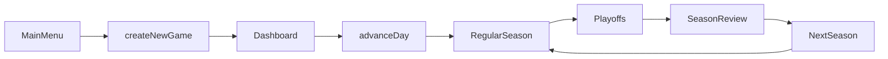

## Application Overview
`valorant-manager` is a browser-only React game with a clean split between:

- `packages/game-core`: pure TypeScript game simulation, state transitions, league generation, season flow, persistence serializers.
- `apps/web`: React/Vite/Tailwind UI, Zustand state store, localStorage persistence, and screens.

There is no backend and no database. The browser owns the save through localStorage.

## High-Level Flow

## Core Game Package
`packages/game-core/src/types/models.ts` defines the core data model:

- `GameState`: the full save state.
- `Team`, `Player`, `PlayerAttributes`: roster data.
- `Fixture`, `MatchResult`, `StandingsRow`: season competition data.
- `SeasonPhase`, `PlayoffBracket`, `SeasonSummary`: multi-season flow.

`packages/game-core/src/gen/new-game.ts` creates a fresh career:
- The 12 VCT Americas teams.
- 5 players per team, with randomly generated attributes/ages/names each save.
- Season 1, regular season phase.
- Initial double round-robin schedule.

`packages/game-core/src/data/sample-league.ts` defines the league:
- 12 real VCT Americas team identities (100T, C9, EG, Envy, FURIA, G2, KRÜ, LEV, LOUD, MIBR, NRG, SEN), each tagged with the `Americas` region.
- Only the team names/colors are fixed; every player (handle, real name, attributes, age) is generated per save from a seed.
- `createSampleTeams(seed)` is deterministic for a given seed, so the new-game screen can preview the exact league the career will use.
- Future regions (EMEA, Pacific, China) can be added as additional leagues.

`packages/game-core/src/gen/schedule.ts` generates the regular season:
- Any even number of teams (12 by default).
- 22 matchdays.
- 6 fixtures per matchday.
- Season-aware fixture IDs.

`packages/game-core/src/gen/playoffs.ts` creates the playoff bracket:
- Top 4 teams by regular-season standings.
- Semifinals: seed 1 vs 4, seed 2 vs 3.
- Final generated after semifinals complete.

`packages/game-core/src/sim/match.ts` contains the pure match simulator:
- First team to 13 rounds wins.
- Team strength comes from player attributes, morale, fatigue, and randomness.
- Produces round score, winner, summary, and player box score.

`packages/game-core/src/loop/advance-day.ts` is the main game loop:
- Simulates fixtures for the current day.
- Updates standings, morale, fatigue, and match history.
- Transitions regular season into playoffs.
- Creates final after semifinals.
- Moves to season review after the final.
- Starts a new season while preserving teams/players.

`packages/game-core/src/loop/offseason.ts` runs during the season rollover:
- Ages every player by one year.
- Develops young players toward their potential and declines older players, with the decline accelerating each year toward retirement.
- Retires aging players (chance starts at age 30 and rises every year, certain by 39) and replaces them with fresh young prospects in the same role.

`packages/game-core/src/loop/selectors.ts` provides read helpers:
- `getStandings()`
- `getNextUserFixture()`
- `getRecentResults()`
- `getCurrentPhaseLabel()`
- `getPlayoffFixtures()`
- `getSeasonChampion()`

`packages/game-core/src/persistence/serializers.ts` handles save serialization:
- Converts `GameState` to/from JSON.
- Migrates old version 1 saves into version 2 season-aware saves.

## Web App
`apps/web/src/store/useGameStore.ts` is the bridge between UI and core:
- Holds current `GameState`.
- Calls core functions like `createNewGame()` and `advanceDay()`.
- Persists save data using Zustand `persist`.
- Uses localStorage key `valorant-manager-save-v1`.

`apps/web/src/App.tsx` selects the current screen:
- Main menu if there is no game.
- Otherwise renders the app shell and active screen.

`apps/web/src/components/AppShell.tsx` provides navigation and layout:
- Sidebar/top nav.
- Shows team, manager, season/day context.

## Main Screens
`apps/web/src/pages/MainMenu.tsx`
- Start a new career.
- Pick manager name and user-controlled team.

`apps/web/src/pages/Dashboard.tsx`
- Main hub.
- Shows season year, phase, current day, team form, next match, recent results.
- Contains the primary `Advance Day` button.

`apps/web/src/pages/Roster.tsx`
- Shows the user team’s 5 players.
- Displays all MVP attributes: `aim`, `gameSense`, `utility`, `clutch`, `communication`, `consistency`, `potential`, `morale`, `fatigue`.

`apps/web/src/pages/Schedule.tsx`
- Shows regular-season fixtures grouped by matchday.
- Shows playoff semifinals/final once generated.

`apps/web/src/pages/Standings.tsx`
- Shows regular-season table.
- Shows playoff seeds once playoffs begin.

`apps/web/src/pages/MatchScreen.tsx`
- Shows next user fixture.
- Handles regular season, playoff semifinal/final, and season review messaging.

`apps/web/src/pages/MatchHistory.tsx`
- Shows current-season match results.
- Shows archived past champions from `seasonHistory`.

`apps/web/src/pages/SaveLoad.tsx`
- Export save JSON.
- Import save JSON.
- Delete save.
- Auto-save is handled by Zustand/localStorage.

## Testing
`packages/game-core/src/__tests__/game-core.test.ts` covers:
- New game generation.
- Match simulation validity.
- Advance-day updates.
- Playoff generation.
- Champion selection.
- Season rollover.
- Save serialization round-trip.

The most important architectural decision is that `apps/web` never owns simulation rules. It only displays state and dispatches actions. All game behavior lives in `packages/game-core`, which keeps future features like training, contracts, scouting, transfers, and richer match simulation easier to add.